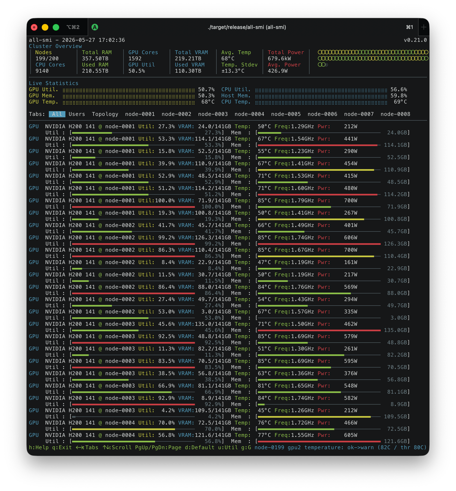
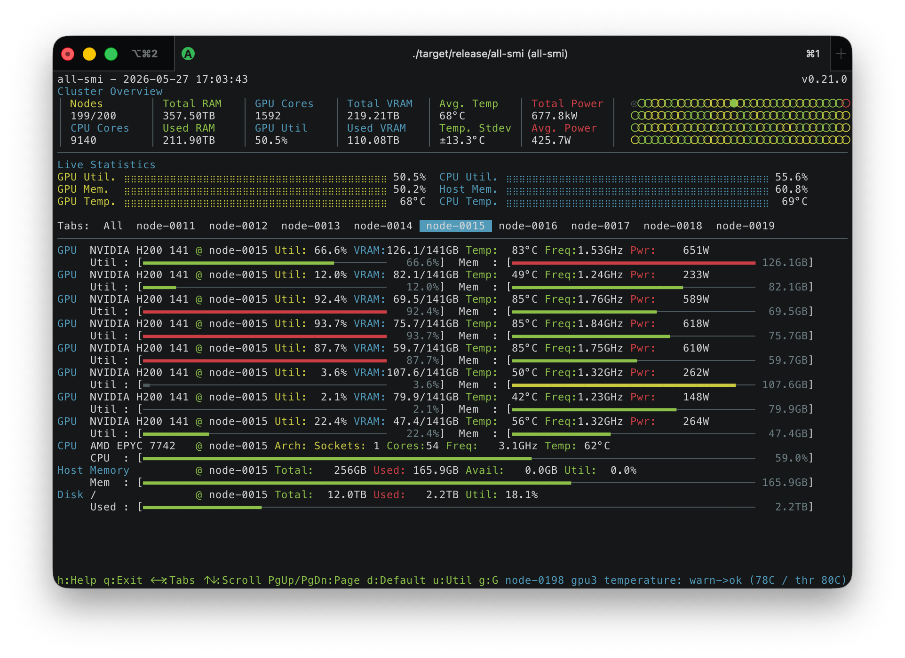

# all-smi

[](https://crates.io/crates/all-smi)
[](https://crates.io/crates/all-smi)


[](https://deps.rs/repo/github/lablup/all-smi)


`all-smi` is a command-line utility for monitoring GPU and NPU hardware across multiple systems. It provides a real-time view of accelerator utilization, memory usage, temperature, power consumption, and other metrics. The tool is designed to be a cross-platform alternative to `nvidia-smi`, with support for NVIDIA GPUs, AMD GPUs, NVIDIA Jetson platforms, Apple Silicon GPUs, Intel Gaudi NPUs, Google Cloud TPUs, Tenstorrent NPUs, Rebellions NPUs, and Furiosa NPUs.

The application presents a terminal-based user interface with cluster overview, interactive sorting, and both local and remote monitoring capabilities. It also provides an API mode for Prometheus metrics integration.



<p align="center">All-node view (remote mode)</p>



<p align="center">Node view (remote mode)</p>

## Installation

### Option 1: Install via Homebrew (macOS/Linux)

The easiest way to install all-smi on macOS and Linux is through Homebrew:

```bash
brew tap lablup/tap
brew install all-smi
```

### Option 2: Install via Ubuntu PPA

For Ubuntu users, all-smi is available through the official PPA:

```bash
# Add the PPA repository
sudo add-apt-repository ppa:lablup/backend-ai
sudo apt update

# Install all-smi
sudo apt install all-smi
```

The PPA provides automatic updates and is maintained for Ubuntu 22.04 (Jammy) and 24.04 (Noble).

### Option 3: Install via Debian Package

For Debian and other Debian-based distributions, download the `.deb` package from the [releases page](https://github.com/inureyes/all-smi/releases):

```bash
# Download the latest .deb package (replace VERSION with the actual version)
wget https://github.com/inureyes/all-smi/releases/download/vVERSION/all-smi_VERSION_OS_ARCH.deb
# Example: all-smi_0.7.0_ubuntu24.04.noble_amd64.deb

# Install the package
sudo dpkg -i all-smi_VERSION_OS_ARCH.deb

# If there are dependency issues, fix them with:
sudo apt-get install -f
```

### Option 4: Download Pre-built Binary

Download the latest release from the [GitHub releases page](https://github.com/inureyes/all-smi/releases):

1. Go to https://github.com/inureyes/all-smi/releases
2. Download the appropriate binary for your platform
3. Extract the archive and place the binary in your `$PATH`

### Option 5: Install from Cargo

Install all-smi through Cargo:

```bash
cargo install all-smi
```

On Linux, you need build dependencies installed first:

```bash
# Ubuntu/Debian
sudo apt-get install pkg-config libssl-dev protobuf-compiler

# Fedora/RHEL
sudo dnf install pkg-config openssl-devel protobuf-compiler protobuf-devel
```

After installation, the binary will be available in your `$PATH` as `all-smi`.

### Option 6: Build from Source

See [Building from Source](DEVELOPERS.md#building-from-source) in the developer documentation.

## Usage

### Command Overview

```bash
# Show help
all-smi --help

# Local monitoring (requires sudo on macOS) - default when no command specified
all-smi
sudo all-smi local

# Remote monitoring (requires API endpoints)
all-smi view --hosts http://node1:9090 http://node2:9090
all-smi view --hostfile hosts.csv

# API mode (expose metrics server)
all-smi api --port 9090

# One-shot JSON/CSV/Prometheus dump for scripts
all-smi snapshot

# Capture a stream to disk for later replay
all-smi record --output trace.ndjson.zst --duration 1h

# Replay a captured stream in the TUI
all-smi view --replay trace.ndjson.zst
```

### Local Mode (Monitor Local Hardware)

The `local` mode monitors your local GPUs/NPUs with a terminal-based interface. This is the default when no command is specified.

```bash
# Monitor local GPUs (requires sudo on macOS)
all-smi              # Default to local mode
sudo all-smi local   # Explicit local mode

# With custom refresh interval
sudo all-smi local --interval 5
```

### Remote View Mode (Monitor Remote Nodes)

The `view` mode monitors multiple remote systems that are running in API mode. This mode requires specifying remote endpoints.

```bash
# Direct host specification (required)
all-smi view --hosts http://gpu-node1:9090 http://gpu-node2:9090

# Using host file (required)
all-smi view --hostfile hosts.csv --interval 2
```

**Note:** The `view` command requires either `--hosts` or `--hostfile`. For local monitoring, use `all-smi local` instead.

Host file format (CSV):
```
http://gpu-node1:9090
http://gpu-node2:9090
http://gpu-node3:9090
```

## Configuration

`all-smi` reads optional settings from a TOML config file. Every field has a compiled default, so a fresh install requires no file; operators only create one when they want persistent overrides (hostfile path, update interval, alert thresholds, `$/kWh`, etc.).

### File locations

| Platform | Canonical path |
|----------|----------------|
| Linux    | `$XDG_CONFIG_HOME/all-smi/config.toml` (fallback `~/.config/all-smi/config.toml`) |
| macOS    | `~/Library/Application Support/all-smi/config.toml` (also accepts `~/.config/all-smi/config.toml`) |
| Windows  | `%APPDATA%\all-smi\config.toml` |

Pass `--config <PATH>` to any subcommand to override the discovery and force a specific file. A missing or malformed `--config` target is a hard error (exit 2); implicit discovery silently falls back to defaults when no candidate file exists.

### Precedence

Highest to lowest: **CLI flag > environment variable > config file > compiled default.** For example, `--port 9091` beats `ALL_SMI_API_PORT=9200` beats `[api] port = 9300` in `config.toml` beats the compiled default of `9090`. Env-var names follow the canonical pattern `ALL_SMI_<SECTION>_<KEY>` in upper-snake; legacy aliases from earlier releases (`ALL_SMI_ALERT_TEMP`, `ALL_SMI_ENERGY_PRICE`, etc.) keep working.

### Helpers

- `all-smi config init [--force]` writes a commented example config to the platform-canonical path. Refuses to overwrite without `--force`. The file is created with `O_NOFOLLOW` and mode `0o600` on Unix.
- `all-smi config print [--format toml|json] [--show-secrets]` prints the fully merged effective configuration. `webhook_url` is redacted unless `--show-secrets` is passed.
- `all-smi config validate [<path>] [--strict]` parses a config file and reports any errors (with line/column on parse failures). Exit 0 valid, 2 invalid. `--strict` rejects unknown keys.

### Reload

Config reload is not supported in v1 — restart the process to pick up changes. This keeps the Prometheus counter and WAL state semantics simple.

### Schema

The canonical schema carries `schema_version = 1` at the top level and sections for `[general]`, `[local]`, `[view]`, `[api]`, `[alerts]`, `[energy]`, `[display]`, `[record]`, and `[snapshot]`. Unknown keys are tolerated by default (forward compat) but warned about in `config print`; `config validate --strict` rejects them. Future schema versions produce a clean error instead of silently loading.

## Platform-Specific Requirements

### macOS (Apple Silicon)
- **No sudo required:** Uses native macOS APIs for metrics collection
  - Uses IOReport API and Apple SMC directly
  - Provides actual temperature readings from SMC sensors
  - Run with: `all-smi local`

### Linux with AMD GPUs
- **Sudo Access Required:** AMD GPU monitoring requires `sudo` to access `/dev/dri` devices
- **ROCm Installation:** AMD GPU support requires ROCm drivers and libraries
- **Build Requirements:**
  - AMD GPU support is available in **glibc builds only** (`x86_64-unknown-linux-gnu`, `aarch64-unknown-linux-gnu`)
  - **Not available in musl builds** (`x86_64-unknown-linux-musl`, `aarch64-unknown-linux-musl`) due to library compatibility
  - For static binaries with AMD GPU support, use the glibc builds
- **Permissions:** Add user to `video` and `render` groups as an alternative to sudo:
  ```bash
  sudo usermod -a -G video,render $USER
  # Log out and back in for changes to take effect
  ```

### Linux with NVIDIA GPUs
- **No Sudo Required:** NVIDIA GPU monitoring works without sudo privileges
- **Driver Required:** NVIDIA proprietary drivers must be installed

### Windows
- **No Sudo Required:** GPU and CPU monitoring works without administrator privileges
- **CPU Temperature Limitations:**
  - Standard Windows WMI thermal zones (MSAcpi_ThermalZoneTemperature) are not available on all systems
  - The application uses a fallback chain to try multiple temperature sources:
    1. ACPI Thermal Zones (standard WMI)
    2. AMD Ryzen Master SDK (AMD CPUs - requires AMD drivers or Ryzen Master)
    3. Intel WMI (Intel CPUs - if chipset drivers support it)
    4. LibreHardwareMonitor WMI (any CPU - if [LibreHardwareMonitor](https://github.com/LibreHardwareMonitor/LibreHardwareMonitor) is running)
  - If temperature is not available, it will be shown as "N/A" without error messages
  - For best temperature monitoring on Windows, install and run LibreHardwareMonitor in the background

## Diagnostics

The `all-smi doctor` subcommand runs a read-only suite of environment checks and
prints a PASS/WARN/FAIL report covering platform, privileges, container
runtime, every supported hardware backend (NVIDIA, AMD, Apple, Gaudi, TPU,
Tenstorrent, Rebellions, Furiosa, Windows), the relevant environment
variables, and optional remote endpoint connectivity. Each check has a hard
3-second timeout.

```bash
# Human-readable report (default)
all-smi doctor

# Machine-readable JSON for CI and scripts
all-smi doctor --json

# Support bundle for attaching to GitHub issues
all-smi doctor --bundle report.tar.gz

# Keep hostnames / IPs / MAC / usernames (default scrubs them)
all-smi doctor --bundle report.tar.gz --include-identifiers

# Run only a subset of checks
all-smi doctor --only platform,privileges

# Skip specific checks (prefix match)
all-smi doctor --skip nvidia.mig.mode

# Probe remote endpoints (DNS, TCP, HTTP /metrics)
all-smi doctor --remote-check http://gpu-node1:9090
```

Exit codes:

- `0` — every check passed (or skipped)
- `1` — at least one check returned WARN
- `2` — at least one check returned FAIL

The `NO_COLOR` environment variable is respected for CI log readability.

### Support Bundle Security

When `--bundle <PATH>` is used, the archive is written with the following
hardening on Unix:

- **Symlink refusal** — the output file is opened with `O_NOFOLLOW`. A
  pre-existing symlink at `<PATH>` causes the command to fail with an error
  rather than following the link (e.g., into `/etc/shadow`).
- **Owner-only permissions** — the file is created with mode `0600` so only
  the invoking user can read or write it.
- **Secret-value redaction** — any environment variable whose name contains a
  known credential keyword (`TOKEN`, `SECRET`, `PASSWORD`, `API_KEY`,
  `ACCESS_KEY`, `PRIVATE_KEY`, `CREDENTIAL`, `AUTH`, `SESSION`, `COOKIE`,
  `BEARER`, `SIGNATURE`, `ENCRYPTION_KEY`, `CLIENT_SECRET`) has its value
  replaced with `<redacted:secret>` in `env.txt`. This redaction is always
  applied, even when `--include-identifiers` is set.
- **`--include-identifiers`** — by default the bundle scrubs hostnames, IPv4,
  IPv6, MAC addresses, and the current username from all text files. Passing
  `--include-identifiers` opts back in to those network-identity tokens only.
  Credential values (above) are **never** restored by this flag.

Stable check IDs (greppable across versions):

| Category | Example IDs |
|---|---|
| `platform.*` | `platform.os`, `platform.runtime`, `platform.cpu`, `platform.memory`, `platform.hardware`, `platform.uptime` |
| `privileges.*` | `privileges.user`, `privileges.root`, `privileges.video_render_group`, `privileges.dev_dri`, `privileges.dev_tenstorrent` |
| `container.*` | `container.runtime`, `container.cgroup`, `container.k8s_serviceaccount` |
| `nvidia.*` | `nvidia.nvml.loadable`, `nvidia.smi.binary`, `nvidia.driver.version`, `nvidia.env.visible_devices`, `nvidia.mig.mode` |
| `amd.*` | `amd.rocm.version`, `amd.libamdgpu_top.abi`, `amd.dri.perms`, `amd.build.target_env` |
| `apple.*` | `apple.macos.version`, `apple.silicon`, `apple.smc` |
| `gaudi.*` | `gaudi.hlsmi`, `gaudi.devices`, `gaudi.driver` |
| `tpu.*` | `tpu.libtpu`, `tpu.env.name`, `tpu.accel.vendor` |
| `tenstorrent.*` | `tenstorrent.luwen`, `tenstorrent.kmd`, `tenstorrent.module` |
| `rebellions.*` | `rebellions.rblnstat`, `rebellions.driver` |
| `furiosa.*` | `furiosa.feature`, `furiosa.smi` |
| `windows.*` | `windows.wmi`, `windows.amd_ryzen_master`, `windows.intel_wmi`, `windows.libre_hardware_monitor` |
| `env.*` | `env.all_smi`, `env.cuda`, `env.rocr`, `env.tpu`, `env.hl` |
| `network.*` | `network.dns`, `network.tcp`, `network.http` |

## Features

### GPU Monitoring
- **Real-time Metrics:** Displays comprehensive GPU information including:
  - GPU Name and Driver Version
  - Utilization Percentage with color-coded status
  - Memory Usage (Used/Total in GB)
  - Temperature in Celsius (or Thermal Pressure for Apple Silicon)
  - Clock Frequency in MHz
  - Power Consumption in Watts (2 decimal precision for Apple Silicon)
- **Multi-GPU Support:** Handles multiple GPUs per system with individual monitoring
- **Interactive Sorting:** Sort GPUs by utilization, memory usage, or default (hostname+index) order
- **Platform-Specific Features:**
  - NVIDIA: PCIe info, performance states (P0–P15), thermal thresholds (slowdown/shutdown/max-operating/acoustic), power limits, vGPU SR-IOV monitoring, MIG (Multi-Instance GPU) monitoring with per-instance utilization and memory metrics, hardware details (NUMA node, GSP firmware mode and version, NvLink remote endpoint classification, GPM SM occupancy and memory bandwidth utilization)
  - AMD: VRAM/GTT memory tracking, fan speed monitoring, GPU process detection with fdinfo
  - NVIDIA Jetson: DLA utilization monitoring
  - Apple Silicon: ANE power monitoring, thermal pressure levels
  - Intel Gaudi NPUs: AIP utilization monitoring, HBM memory tracking, device variant detection (PCIe/OAM/UBB)
  - Google Cloud TPUs: Support for TPU v2-v7/Ironwood, HBM memory tracking, libtpu/JAX integration
  - Tenstorrent NPUs: Real-time telemetry via luwen library, board-specific TDP calculations
  - Rebellions NPUs: Performance state monitoring, KMD version tracking, device status
  - Furiosa NPUs: Per-core PE utilization, power governor modes, firmware version tracking
  
### CPU Monitoring
- **Comprehensive CPU Metrics:**
  - Real-time CPU utilization with per-socket breakdown
  - Core and thread counts
  - Frequency monitoring (P+E format for Apple Silicon)
  - Temperature and power consumption
- **Apple Silicon Enhanced:**
  - P-core and E-core utilization tracking
  - P-cluster and E-cluster frequency monitoring
  - Integrated GPU core count

### Memory Monitoring
- **System Memory Tracking:**
  - Total, used, available, and free memory
  - Memory utilization percentage
  - Swap space monitoring
  - Linux: Buffer and cache memory tracking
- **Visual Indicators:** Color-coded memory usage bars

### Process Monitoring
- **Enhanced GPU Process View:**
  - Process ID (PID) and Parent PID
  - Process Name and Command Line
  - GPU Memory Usage with per-column coloring
  - CPU usage percentage
  - User and State Information
- **Advanced Features:**
  - Mouse click sorting on column headers
  - Multi-criteria sorting (PID, memory, GPU memory, CPU usage)
  - Per-column color coding for better visibility
  - Full process tree integration

### Chassis/Node-Level Monitoring
- **System-Wide Power Tracking:**
  - Total chassis power consumption (CPU+GPU+ANE combined)
  - Individual power component breakdown
  - Real-time power efficiency monitoring
- **Thermal Monitoring:**
  - Thermal pressure levels (Apple Silicon)
  - Inlet/outlet temperature tracking (BMC-enabled servers)
  - Fan speed monitoring with per-fan granularity
- **Platform-Specific Features:**
  - Apple Silicon: CPU, GPU, ANE power breakdown with thermal pressure
  - Server systems: BMC sensor integration for comprehensive thermal monitoring

### Energy & Cost Accounting
- **Energy session row** under each chassis card shows cumulative Joules /
  kWh and, when a price is configured, the approximate monetary cost for the
  current session. The session starts when the process boots (or after the
  `R` hotkey; see below) and is reset without touching the lifetime
  Prometheus counter.
- **`R` hotkey** zeroes the per-session counter and the "session started"
  timestamp across every device so you can quickly bracket a workload.
  The Prometheus `all_smi_energy_consumed_joules_total` counter keeps
  climbing monotonically — `rate()` / `increase()` stay well-defined.
- **WAL persistence** — in API mode the integrator periodically flushes
  accumulated Joules to a write-ahead log so the Prometheus counter
  survives restarts. The file lives at `~/.cache/all-smi/energy-wal.bin`
  by default, is opened with `O_NOFOLLOW` + mode `0o600` on Unix, and is
  compacted automatically once it grows past ~16 MiB. Flush + fsync run
  on a dedicated blocking task so a slow filesystem (NFS, SAN failover)
  cannot stall the tokio runtime.
- **Environment overrides** (the Prometheus counter is always exported;
  these only affect the TUI display and the WAL):
  - `ALL_SMI_ENERGY_PRICE=<price_per_kwh>` — set the price used for the
    cost column. Invalid / non-finite values are silently ignored.
  - `ALL_SMI_ENERGY_CURRENCY=<code>` — display-only currency code
    (`USD`, `KRW`, `EUR`, …).
  - `ALL_SMI_ENERGY_NO_COST=1` — hide the cost column even if a price
    is set.
  - `ALL_SMI_ENERGY_WAL_PATH=/alt/path/energy-wal.bin` — override the
    default WAL location.
  - `ALL_SMI_ENERGY_NO_WAL=1` — disable the WAL entirely (counters
    stay in memory only).
  - `ALL_SMI_ENERGY_GAP_SECONDS=<seconds>` — gap threshold above which
    the integrator holds the last sample instead of interpolating.
    Accepted range is `1..=3600`; values outside that window fall
    back to the 10-second default.

### Cluster Management

> Note: The Cluster Overview Dashboard, Live Statistics History, and Tabbed Interface appear only in remote mode (when `--hosts` or `--hostfile` is specified). Local mode replaces these with a compact two-line host summary bar showing hostname, CPU model, architecture, uptime, and live sparkline metrics (CPU%, GPU%, RAM, power, temperature).

- **Cluster Overview Dashboard:** Real-time statistics showing:
  - Total nodes and GPUs across the cluster
  - Average utilization and memory usage
  - Temperature statistics with standard deviation
  - Total and average power consumption
  - Per-node LED grid (rendered beside the overview cards): one dot per node, colored by GPU utilization, with filled/hollow/crossed symbols for selected/connected/disconnected states
- **Live Statistics History:** Full-width braille sparkline panel showing GPU and CPU utilization, memory, and temperature side by side
- **Tabbed Interface:** Switch between "All" view and individual host tabs
- **Adaptive Update Intervals:**
  - Local monitoring: 1 second (Apple Silicon) or 2 seconds (others)
  - 1-10 remote nodes: 3 seconds
  - 11-50 nodes: 4 seconds
  - 51-100 nodes: 5 seconds
  - 101+ nodes: 6 seconds

### Cross-Platform Support
- **Linux:**
  - NVIDIA GPUs via NVML and nvidia-smi (fallback)
  - AMD GPUs (Radeon and Instinct) via ROCm and libamdgpu_top library
    - Real-time VRAM and GTT memory monitoring
    - GPU process detection with memory usage tracking
    - Temperature, power consumption, frequency, and fan speed metrics
    - Requires sudo access to /dev/dri devices (glibc builds only)
  - CPU monitoring via /proc filesystem
  - Memory monitoring with detailed statistics
  - Intel Gaudi NPUs (Gaudi 1/2/3) via hl-smi with background process monitoring
  - Google Cloud TPUs (v2-v7/Ironwood) via libtpu with JAX/Python integration
  - Tenstorrent NPUs (Grayskull, Wormhole, Blackhole) via luwen library
  - Rebellions NPUs (ATOM, ATOM+, ATOM Max) via rbln-stat
  - Furiosa NPUs (RNGD) via furiosa-smi
- **macOS:**
  - Apple Silicon (M1/M2/M3/M4) GPUs monitoring
  - Native APIs: IOReport, SMC for no-sudo operation
  - ANE (Apple Neural Engine) power tracking
  - Actual CPU/GPU temperature readings from SMC sensors
  - Thermal pressure monitoring
  - P/E core architecture support
- **NVIDIA Jetson:** 
  - Special support for Tegra-based systems
  - DLA (Deep Learning Accelerator) monitoring

### Remote Monitoring
- **Multi-Host Support:** Monitor up to 256+ remote systems simultaneously
- **Connection Management:** Optimized networking with:
  - Connection pooling (200 idle connections per host)
  - Concurrent connection limiting (64 max)
  - Automatic retry with exponential backoff
  - TCP keepalive for persistent connections
  - Connection staggering to prevent overload
- **Storage Monitoring:** Disk usage information for all hosts
- **High Availability:** Resilient to connection failures with automatic recovery

### Interactive UI
- **Enhanced Controls:**
  - Keyboard: Arrow keys, Page Up/Down, Tab switching
  - Mouse: Click column headers to sort (process view)
  - Sorting: 'd' (default), 'u' (utilization), 'g' (GPU memory), 'p' (PID), 'm' (memory), 'c' (CPU)
  - Filtering: 'f' (toggle GPU process filter - show only processes with GPU memory usage)
  - Query filter: '/' (open query bar), 'Ctrl-R' (recall last query), 'ESC' (clear)
  - Alerts: 'A' (toggle alert history panel)
  - Users tab: 'V' (jump to cluster-wide user aggregation tab)
  - Interface: '1'/'h' (help), 'q' (quit), ESC (close help)
- **Visual Design:**
  - Color-coded status: Green (≤60%), Yellow (60-80%), Red (>80%)
  - Per-column coloring in process view
  - Responsive layout adapting to terminal size
  - Double-buffered rendering for flicker-free display
- **Help System:** Context-sensitive help with all keyboard shortcuts

### Cluster-Wide Users Tab (`V`)

Remote `view` mode adds a **Users** tab that aggregates per-process metrics
across every scraped host so operators can answer "who is using the cluster
and how much?" at a glance. Enable per-host process collection with
`all-smi api --processes` on every node, then press `V` in the remote view to
jump to the tab (it sits right after `All` in the tab row and is cycled by the
arrow keys).

Columns:

| Column | Meaning |
| --- | --- |
| `USER` | Username from the per-process metrics (`?` when a host emits rows without `user` labels, e.g. Windows API mode) |
| `NODES` | Distinct hosts the user has at least one process on |
| `GPUs` | Distinct `(host, gpu_index)` pairs the user touches |
| `PROCS` | Distinct `(host, pid)` pairs — the same PID on two hosts counts as two processes |
| `VRAM` | Sum of GPU memory across all of the user's processes |
| `POWER*` | Weighted power approximation (see below) |
| `LONGEST` | Oldest `TIME+` value across the user's processes |
| `CMD (top-1 by GPU mem)` | Command owning the largest VRAM row |

**Power approximation.** `POWER*` is computed as

```
sum_over_gpus(
  gpu.power × (user_vram_on_gpu / total_vram_on_gpu_across_all_users)
)
```

per GPU the user touches, summed across GPUs. The formula is an
approximation because `nvidia-smi`/NVML does not report per-process power
directly; we proxy it with the user's share of VRAM on each GPU. The value
is clamped to ≥ 0 to guard against race conditions where the sum of process
VRAM exceeds the GPU's reported `memory_used`. The `*` in the header marks
the column as approximate.

**In-tab keybindings**

- `u` sort by username (default)
- `m` sort by total GPU memory
- `p` sort by total power (derived)
- `n` sort by node count
- `t` sort by oldest process start time (`LONGEST`)
- `Enter` drill down into the highlighted user (per-host breakdown)
- `Enter` again drills into the host for the selected user (process list)
- `ESC` exits drill-down (ESC outside drill-down returns to normal handling)
- `f` toggles the system-account filter (hides `root`/`uid<1000` by default)
- `e` exports the current visible table to
  `~/.cache/all-smi/users-<timestamp>.csv`

**Partial coverage.** When some hosts report `--processes` data and others
don't, the tab shows a yellow chip `⚠ partial coverage: M of N nodes reporting
process data` so operators don't misread the numbers. If zero hosts report
process data, the tab renders a hint pointing at the `--processes` flag
instead of an empty table.

Mock clusters can exercise the tab without real hosts by setting
`ALL_SMI_MOCK_PROCESSES=1`, which makes every synthetic node emit a small
rotation of users and commands through the `all_smi_process_*` metric
families.

### Topology View (`T`)

Remote and replay `view` modes add a **Topology** tab that visualises the
selected host's intra-node GPU interconnect: NvLink connections
(GPU↔GPU, GPU↔NvSwitch), NUMA affinity, and PCIe lanes. Press `T` to
jump to the tab (it sits right after `Users`); use the arrow keys
(`Left`/`Right`) to cycle between hosts while the Topology tab is active.
The tab remembers the host you last selected so pressing `T` returns to
the same node instead of snapping to the first one in the strip.

Two render modes are available; press `M` to toggle between them:

- **Graph mode** (default) — ASCII layout showing NUMA zones as boxes
  with GPUs inside and NvLink / NvSwitch edges drawn between them.
  NUMA boxes stack side-by-side on wide terminals and fall back to
  vertical stacking on narrower ones.
- **Matrix mode** — `nvidia-smi topo -m`-equivalent table with CPU
  affinity and NUMA columns. Uses the same vocabulary: `X`=self,
  `NVn`=NvLink Gen-n, `NSW`=NvSwitch, `PXB`=PCIe bridge, `NODE`=same
  NUMA, `SYS`=across NUMA.

**Graceful degradation.** The tab is designed to produce useful output
on every platform:

- Hosts without NvLink render only NUMA + PCIe groupings.
- Non-NVIDIA hosts omit the `NVn`/`SYS` vocabulary and show NUMA groups
  only.
- Hosts without NUMA topology render a single synthetic `NUMA ?` box.
- When the terminal is narrower than 100 columns the graph renderer
  drops to matrix mode automatically so the content never overflows on
  80-column sessions.

**Bandwidth hints.** When the exporter provides a per-link bandwidth
(`bandwidth_mb_s` label on `all_smi_nvlink_remote_device_type`), the
matrix derives the NVn generation from it (e.g. 50 GB/s → `NV5`).
Without the hint the renderer falls back to a generic `NV` label so no
hallucinated generation reaches the operator.

Mock clusters can exercise the tab by setting `ALL_SMI_MOCK_TOPOLOGY=1`.
Every synthetic NVIDIA node then emits a DGX-like 8-GPU topology: two
NUMA zones, full 7-link GPU-to-GPU mesh, and one switch link per GPU.

### Filtering & Alerts

Press `/` in any tab to open the filter query bar and hide/dim GPUs that do not
match a small DSL. The query compiles once and is evaluated per row per frame,
so the filter stays active across refreshes and tab switches until you clear
it with `ESC`.

**Filter DSL**

- Fields: `temp`, `util`, `mem_pct`, `mem_used`, `mem_total`, `power`, `user`,
  `host`, `gpu_name`, `driver`, `index`, `uuid`, `pstate`, `numa`,
  `device_type`.
- Numeric operators: `>`, `>=`, `<`, `<=`, `==`, `!=`.
- String operators: `==`, `!=`, `~=` (regex, size-bounded to 128 KiB).
- Combine with `&` / `|` and parenthesise with `(...)`.
- Unknown field names are a parse error; fields that a device does not expose
  (e.g. `temp` on a CPU row) make the row *not match* so mixed views stay
  readable.

Examples:

```text
/                               # open the bar
temp>85                         # GPUs over 85 °C
util<5 & power>300              # idling but still drawing power
host~=dgx                       # only dgx-* nodes
user==alice | user==bob         # either user
(temp>80 | util>90) & numa==0   # hot-or-busy GPUs on NUMA 0
```

Press `Enter` to commit, `Ctrl-R` to cycle the last five queries, and `ESC`
to clear. Invalid queries surface an inline red `parse error: ... at col N`
message without committing.

**Threshold alerts**

Alert thresholds live in the compiled defaults today (the config-file loader
lands in a separate issue). Override them with CLI flags:

```bash
all-smi local --alert-temp 75 --alert-util-low-mins 10
all-smi view --hosts http://n01:9090 --alert-temp 75
```

When a GPU crosses a threshold, all-smi emits:

- A 5-second toast in the status bar.
- A 2-second red border flash on the affected GPU card.
- An entry in an in-memory ring buffer (last 50 transitions).

Press `A` to toggle the alert history panel, `ESC` to close it. When the
`[alerts] webhook_url` option is set, each transition is POSTed to the
configured URL as `{timestamp, host, gpu_index, rule, from, to, value,
threshold}` JSON with a 2-second timeout, fire-and-forget.

**Security notes**

- **Webhook SSRF protection**: HTTP redirects are disabled on the webhook
  client. If the configured URL responds with a 3xx redirect the response
  is logged and the redirect target is *not* followed. This prevents a
  misconfigured or attacker-controlled endpoint from pivoting the client to
  cloud-metadata services (e.g. `169.254.169.254`) or other internal-only
  hosts. Operators should configure the exact destination URL directly.
- **Filter query buffer cap**: The interactive filter bar accepts at most
  512 characters. Input beyond that limit is silently discarded. This keeps
  a bracketed-paste of large text from turning every keystroke into an
  unbounded O(n) re-parse. The lexer independently rejects inputs exceeding
  16 KiB as an additional safeguard for any programmatic caller.
- **Users tab CSV export (`e`) — symlink refusal**: The export file is
  opened with `O_NOFOLLOW` and mode `0600`. On a shared machine a co-tenant
  could pre-plant `~/.cache/all-smi` or the final filename as a symlink to
  redirect the write to an arbitrary path. This is refused: any pre-existing
  symlink at either the cache directory path or the timestamped filename
  causes the export to fail with an error rather than follow the link.
  Windows falls back to `share_mode(0)` (exclusive access).
- **Users tab CSV export — formula injection mitigation**: Usernames and
  command lines in the exported CSV come from untrusted remote hosts.
  Spreadsheet applications (Excel, LibreOffice Calc, Google Sheets) treat
  cells whose first character is `=`, `+`, `-`, `@`, TAB, or CR as formula
  expressions and may execute embedded commands when the file is opened.
  All such fields are quoted per RFC 4180 and prefixed with a single quote
  (`'`) inside the quoted value so the spreadsheet treats them as plain text.
- **Process label caps in the remote parser**: The Prometheus scrape parser
  enforces per-field length limits on process-metric labels received from
  remote hosts — `user` and `command` are capped at 128 and 256 bytes
  respectively (truncated at a UTF-8 boundary), and the global label parser
  rejects any string longer than 1024 bytes per key or value and any metric
  block with more than 100 labels. This bounds the memory a malicious host
  can consume via the `all_smi_process_*` metric families.

### Development & Testing
- **Mock Server:** Built-in mock server for testing and development
  - Simulates realistic GPU clusters with 8 GPUs per node
  - Configurable port ranges for multiple instances
  - Failure simulation for resilience testing
  - Platform-specific metric generation (NVIDIA, AMD, Apple Silicon, Jetson, Intel Gaudi, Google TPU, Tenstorrent, Rebellions, Furiosa)
  - Background metric updates with realistic variations
  - Set `ALL_SMI_MOCK_VGPU=1` to simulate NVIDIA vGPU SR-IOV data without real vGPU hardware
  - Set `ALL_SMI_MOCK_MIG=1` to simulate NVIDIA MIG (Multi-Instance GPU) data without MIG hardware
  - Set `ALL_SMI_MOCK_HARDWARE_DETAILS=1` to include extended NVIDIA hardware detail metrics (NUMA node ID, GSP firmware mode/version, NvLink remote endpoint types, GPM SM occupancy/memory bandwidth utilization, thermal thresholds, P-state); omitted by default to simulate older drivers that do not expose these APIs
- **Performance Optimized:**
  - Template-based response generation
  - Efficient memory management
  - Minimal CPU overhead

### API Mode (Prometheus Metrics)

Expose hardware metrics in Prometheus format for integration with monitoring systems:

```bash
# Start API server on TCP port
all-smi api --port 9090

# Custom update interval (default: 3 seconds)
all-smi api --port 9090 --interval 5

# Include process information
all-smi api --port 9090 --processes

# Unix Domain Socket support (Unix only)
all-smi api --socket                              # Default path
all-smi api --socket /custom/path.sock            # Custom path
all-smi api --port 9090 --socket                  # TCP + UDS simultaneously
all-smi api --port 0 --socket                     # UDS only (disable TCP)

# Access via Unix socket
curl --unix-socket /tmp/all-smi.sock http://localhost/metrics
```

**Unix Domain Socket Details:**
- Default paths: `/tmp/all-smi.sock` (macOS), `/var/run/all-smi.sock` or `/tmp/all-smi.sock` (Linux)
- Socket permissions are set to `0600` for security (owner-only access)
- Socket file is automatically cleaned up on shutdown
- Currently Unix-only (Linux, macOS); Windows support pending Rust ecosystem maturity

Metrics are available at `http://localhost:9090/metrics` (TCP) or via Unix socket and include comprehensive hardware monitoring for:
- **GPUs:** Utilization, memory, temperature, power, frequency (NVIDIA, AMD, Apple Silicon, Intel Gaudi, Google TPU, Tenstorrent)
- **NVIDIA hardware details:** NUMA node ID, GSP firmware mode and version, NvLink remote endpoint type per active link, GPM SM occupancy and memory bandwidth utilization (all omitted when the driver does not support the underlying API)
- **NVIDIA vGPUs:** Per-vGPU utilization, framebuffer memory, scheduler state, and SR-IOV host mode (emitted only on vGPU-enabled hosts)
- **NVIDIA MIG:** Per-GPU MIG mode status and per-MIG-instance utilization, framebuffer memory used/total (emitted only on MIG-enabled hosts)
- **CPUs:** Utilization, frequency, temperature, power (with P/E core metrics for Apple Silicon)
- **Memory:** System and swap memory statistics
- **Storage:** Disk usage information
- **Chassis:** Node-level power consumption, thermal pressure, inlet/outlet temperatures, fan speeds
- **Processes:** GPU process metrics including AMD fdinfo-based tracking (with --processes flag)

For a complete list of all available metrics, see [API.md](API.md).

### Scripting / CI (Snapshot Mode)

The `snapshot` subcommand emits a single, one-shot machine-readable dump of
the current hardware state to stdout (or a file) and exits. It is designed
for shell piping, CI probes, Slurm prolog/epilog hooks, and any tool that
wants `nvidia-smi --query-gpu=... --format=csv` ergonomics without starting
a long-running HTTP server.

```bash
# Default: pretty-printed JSON when stdout is a TTY, compact when piped.
all-smi snapshot

# JSON piped to jq — pretty-print auto-off avoids shell pipeline churn.
all-smi snapshot --format json | jq '.gpus[] | {name, utilization, temperature}'

# CSV with nvidia-smi-style columns. Scope to GPUs with --include gpu to
# keep the rows focused; the default CSV includes one row per CPU/memory
# /chassis device too, which is usually not what you want for GPU tooling.
all-smi snapshot --format csv --include gpu \
  --query index,name,utilization,used_memory,total_memory,temperature,power_consumption

# Prometheus exposition matching a single /metrics scrape.
all-smi snapshot --format prometheus > /tmp/snapshot.prom

# Take three samples one second apart, write a JSON array to a file.
all-smi snapshot --samples 3 --interval 1 --output /tmp/snapshot-series.json

# Include opt-in expensive sections (processes, storage).
all-smi snapshot --include gpu,cpu,memory,chassis,process,storage

# Exit non-zero when a reader times out hard enough to collect nothing.
if ! all-smi snapshot --timeout-ms 2000 --format json >/dev/null; then
    echo "no devices could be read"
    exit 1
fi
```

**Exit codes**

| Code | Meaning                                                                   |
|------|---------------------------------------------------------------------------|
| `0`  | Success. Output was written; the `errors` array may contain partial failures. |
| `1`  | Hard failure. No devices were collected from any reader.                  |
| `2`  | Flag parse error (invalid `--include`, unknown format, etc.).             |

**Slurm prolog example** — fail the prolog when a GPU is too hot to accept a
job, using `jq` to enforce a temperature cap:

```bash
#!/usr/bin/env bash
set -euo pipefail

TEMP_MAX=85
JSON="$(all-smi snapshot --format json --include gpu)"
HOT_COUNT="$(echo "$JSON" | jq "[.gpus[] | select(.temperature >= $TEMP_MAX)] | length")"
if [[ "$HOT_COUNT" -gt 0 ]]; then
    echo "Refusing to start: $HOT_COUNT GPU(s) at or above ${TEMP_MAX}C" >&2
    echo "$JSON" | jq '.gpus[] | {name, temperature}' >&2
    exit 1
fi
```

**CSV → awk pipeline** — compute average utilization across all GPUs:

```bash
all-smi snapshot --format csv --include gpu --query utilization \
  | awk -F, 'NR > 1 { sum += $1; n++ } END { if (n) printf "avg=%.1f%%\n", sum/n }'
```

**Options summary**

| Flag              | Default                           | Description                                      |
|-------------------|-----------------------------------|--------------------------------------------------|
| `--format`        | `json`                            | `json` / `csv` / `prometheus`.                   |
| `--pretty`        | auto (on when stdout is a TTY)    | Force pretty-print on or off for JSON.           |
| `--include`       | `gpu,cpu,memory,chassis`          | Comma-separated sections to collect.             |
| `--query`         | section-specific defaults         | CSV columns as comma-separated dot paths.        |
| `--samples`       | `1`                               | Number of samples to collect.                    |
| `--interval`      | `0`                               | Seconds between samples (only if `--samples > 1`). |
| `--timeout-ms`    | `5000`                            | Per-reader timeout in milliseconds.              |
| `--output` / `-o` | stdout                            | Write to this path (`-` also means stdout). On Unix: created with mode `0600` (owner-only), symlinks refused, atomic write via sibling `.tmp` + rename. |

### Recording & Replay

The `record` subcommand captures a live metric stream to disk as NDJSON, and
`view --replay <file>` plays it back through the same TUI the operator would
have seen live. Intended for post-hoc incident investigation without a
Prometheus retention store — operators can rewind to the moment throughput
cratered and see the exact GPU/CPU/memory/chassis state at that tick.

Each captured frame uses the same JSON shape as `snapshot --format json`
(same serializer), plus an optional header frame and sparse index frames
every 1000 data frames to enable fast seeking.

```bash
# Capture 30 seconds of local hardware state to a zstd-compressed file.
all-smi record --output incident.ndjson.zst --duration 30s --interval 1

# Record until SIGTERM; rotate at 100MB per segment, keep last 10 files.
all-smi record --output trace.ndjson.zst --max-size 100M --max-files 10

# Record remote cluster scrapes (same HTTP path as `view`).
all-smi record --source remote \
  --hosts http://gpu-node1:9090 http://gpu-node2:9090 \
  --output cluster.ndjson.gz --compress gzip --duration 1h

# Replay a captured file — identical TUI to the live view.
all-smi view --replay incident.ndjson.zst

# Start playback at 14:32 (HH:MM:SS) and loop.
all-smi view --replay incident.ndjson.zst --start 00:14:32 --loop

# Replay at 4x speed.
all-smi view --replay incident.ndjson.zst --speed 4.0
```

**Replay-mode keybindings** (active only with `--replay`):

| Key          | Action                                               |
|--------------|------------------------------------------------------|
| `SPACE`      | Play / pause                                         |
| `]` / `[`    | Step one frame forward / back (auto-pauses)          |
| `+` / `-`    | Cycle speed through `0.25, 0.5, 1.0, 2.0, 4.0, 8.0`  |
| `j` / `k`    | Seek -10s / +10s                                     |
| `g`          | Open timecode editor (`HH:MM:SS` then Enter)         |
| `L`          | Toggle loop playback                                 |
| `q` / `Esc`  | Exit replay                                          |

The status bar shows `REPLAY | HH:MM:SS | frame N / M | Xx | playing/paused`.
Filter-edit mode (`/`) still takes precedence over replay keys, so the
operator can filter the visible GPUs mid-playback.

**`record` options summary**

| Flag              | Default                           | Description                                      |
|-------------------|-----------------------------------|--------------------------------------------------|
| `--output` / `-o` | `all-smi-record.ndjson.zst`       | Output path. Extension picks the codec.          |
| `--interval` / `-i` | `3`                             | Seconds between frames.                          |
| `--duration`      | `0` (= record until SIGTERM)      | Accepts `30s`, `5m`, `1h`, `1d`, or bare seconds. |
| `--source`        | `local`                           | `local` (hardware readers) or `remote` (HTTP scrape). |
| `--hosts` / `--hostfile` | (none)                     | Required when `--source=remote`.                 |
| `--include`       | `gpu,cpu,memory,chassis`          | Comma-separated sections (plus `process`).       |
| `--max-size`      | `100M`                            | Rotation threshold per segment (`1K`, `10M`, `2G`). `0` disables rotation. |
| `--max-files`     | `10`                              | Max segments on disk (active + rotated).         |
| `--compress`      | auto (from extension)             | `zstd` / `gzip` / `none`.                        |

**Security invariants**

`record` and `view --replay` apply the following hardening that cannot be
disabled:

- **Writer — symlink refusal.** On Unix the output file is opened with
  `O_NOFOLLOW` and mode `0600`. A pre-existing symlink at the target path
  causes `record` to exit immediately rather than follow the link. The same
  check applies when rolling over to a numbered segment: if a symlink is found
  at the rollover path, the rotation is aborted.
- **Replay — per-line size cap.** Each decompressed NDJSON line is limited to
  16 MiB. A `.zst` or `.gz` file that expands a single line beyond this limit
  (decompression-bomb attack) is treated as a corrupted line: it is skipped
  with a warning and reading continues from the next line.
- **Replay — zstd window ceiling.** The zstd decoder is configured with a
  128 MiB window-log ceiling. A stream declaring a larger window is rejected
  before decompression begins.
- **Replay — hosts list cap.** A replay header advertising more than 1024 host
  entries is truncated to 1024 at parse time so the TUI tab row cannot be
  overwhelmed by a hostile recording.

### Quick Start with Make Commands

For development and testing, you can use the provided Makefile:

```bash
# Run local monitoring
make local

# Run remote view mode with hosts file
make remote

# Start mock server for testing
make mock

# Build release version
make release

# Run tests
make test
```

## Library API

`all-smi` can also be used as a Rust library for building custom monitoring tools or integrating hardware metrics into your applications.

### Add Dependency

Add to your `Cargo.toml`:

```toml
[dependencies]
all-smi = "0.15"
```

### Basic Usage

```rust
use all_smi::{AllSmi, Result};

fn main() -> Result<()> {
    // Initialize with auto-detection
    let smi = AllSmi::new()?;

    // Get all GPU/NPU information
    for gpu in smi.get_gpu_info() {
        println!("{}: {}% utilization, {:.1}W",
            gpu.name, gpu.utilization, gpu.power_consumption);
    }

    // Get CPU information
    for cpu in smi.get_cpu_info() {
        println!("{}: {:.1}% utilization", cpu.cpu_model, cpu.utilization);
    }

    // Get memory information
    for mem in smi.get_memory_info() {
        println!("Memory: {:.1}% used", mem.utilization);
    }

    Ok(())
}
```

### Using the Prelude

For convenience, import all common types:

```rust
use all_smi::prelude::*;

fn main() -> Result<()> {
    let smi = AllSmi::new()?;

    // Types like GpuInfo, CpuInfo, MemoryInfo are available
    let gpus: Vec<GpuInfo> = smi.get_gpu_info();
    println!("Found {} GPU(s)", gpus.len());

    Ok(())
}
```

### Available Methods

| Method | Returns | Description |
|--------|---------|-------------|
| `get_gpu_info()` | `Vec<GpuInfo>` | GPU/NPU metrics (utilization, memory, temp, power) |
| `get_cpu_info()` | `Vec<CpuInfo>` | CPU metrics (utilization, frequency, temp) |
| `get_memory_info()` | `Vec<MemoryInfo>` | System memory metrics |
| `get_process_info()` | `Vec<ProcessInfo>` | GPU process information |
| `get_chassis_info()` | `Option<ChassisInfo>` | Node-level power and thermal info |
| `get_vgpu_info()` | `Vec<VgpuHostInfo>` | NVIDIA vGPU host and per-instance metrics (empty on non-vGPU hosts) |
| `get_mig_info()` | `Vec<MigGpuInfo>` | NVIDIA MIG per-GPU mode status and per-instance metrics (empty on non-MIG hosts) |

### Configuration

```rust
use all_smi::{AllSmi, AllSmiConfig};

let config = AllSmiConfig::new()
    .sample_interval(500)  // 500ms sample interval
    .verbose(true);        // Enable verbose warnings

let smi = AllSmi::with_config(config)?;
```

### Thread Safety

`AllSmi` is `Send + Sync` and can be safely shared across threads:

```rust
use std::sync::Arc;
use std::thread;

let smi = Arc::new(AllSmi::new()?);

let smi_clone = smi.clone();
thread::spawn(move || {
    let gpus = smi_clone.get_gpu_info();
    // ...
});
```

For more examples, see `examples/library_usage.rs` in the repository.

## Development

For development documentation including building from source, testing with mock servers, architecture details, and technology stack information, see [DEVELOPERS.md](DEVELOPERS.md).

## Testing

For comprehensive testing documentation including unit tests, integration tests, and shell script tests, see [TESTING.md](TESTING.md).

### Quick Test Commands
```bash
# Run all unit tests (no sudo required)
cargo test

# Run tests including those requiring sudo (macOS only)
sudo cargo test -- --include-ignored

# Run shell script tests for containers and real-world scenarios
cd tests && make all
```

## Contributing

Contributions are welcome! Areas for contribution include:

- **Platform Support:** Additional GPU vendors or operating systems
- **Features:** New metrics, visualization improvements, or monitoring capabilities
- **Performance:** Optimization for larger clusters or resource usage
- **Documentation:** Examples, tutorials, or API documentation

Please submit pull requests or open issues for bugs, feature requests, or questions.

## Acknowledgments

This project is being developed with tremendous help from [Claude Code](https://claude.ai/code) and [Gemini CLI](https://github.com/google-gemini/gemini-cli). These AI-powered development tools have been instrumental in accelerating the development process, improving code quality, and implementing complex features across multiple hardware platforms.

The journey of building all-smi with AI assistance has been a fascinating exploration of how domain expertise guides AI capabilities. From the initial three-day Rust learning sprint with Google AI Studio and ChatGPT to the recent development with Gemini CLI and Claude Code, this project demonstrates that the boundary of AI coding capability is tightly bound by the expertise of the person guiding it. [Read the full development story here](docs/AI_DEVELOPMENT_STORY.md).

## License

This project is licensed under the Apache License 2.0.  
See the [LICENSE](./LICENSE) file for details.

## Changelog

### Recent Updates
- **v0.21.0 (upcoming):** Add cluster-wide Users tab (`V` key in remote `view` mode) — aggregates per-process metrics across all scraped hosts into a single table with columns USER, NODES, GPUs, PROCS, VRAM, POWER* (weighted approximation), LONGEST, and CMD; in-tab keys u/m/p/n/t for sorting, Enter for two-level drill-down (user → host → process list), ESC to exit drill-down, f to toggle system-account filter (uid<1000), and e to export the visible table to `~/.cache/all-smi/users-<timestamp>.csv`; partial-coverage chip warns when only a subset of hosts report `--processes` data; mock support via `ALL_SMI_MOCK_PROCESSES=1`; CSV export hardened with O_NOFOLLOW + mode 0600 symlink refusal, RFC 4180 quoting, and formula-injection mitigation; remote parser enforces per-field label caps for process metrics. **BREAKING**: Rename Prometheus GPU labels `index`→`gpu_index` and `uuid`→`gpu_uuid` across all NVIDIA-specific metrics (pcie, thermal thresholds, performance state, hardware details, vGPU, MIG); also rename `index`→`npu_index` and `uuid`→`npu_uuid` across all non-NVIDIA NPU exporters (Tenstorrent, Rebellions, Furiosa, Gaudi, Google TPU) and NPU mock templates; remote parser accepts both old and new label names for backward compatibility during migration. Add NVIDIA vGPU SR-IOV monitoring — per-vGPU utilization, framebuffer memory, scheduler state, and host mode exported as Prometheus metrics; TUI renders per-GPU vGPU sub-sections; remote parser reconstructs vGPU view from scraped metrics; mock server can simulate vGPU data via `ALL_SMI_MOCK_VGPU=1`. Add NVIDIA extended thermal monitoring — slowdown, shutdown, max-operating, and acoustic temperature thresholds exported as Prometheus metrics; TUI shows per-GPU thermal row with proximity highlighting (yellow within 5°C of slowdown, red within 2°C of shutdown); P-state (P0–P15) surfaced in TUI and metrics; all fields degrade gracefully to `None` on older drivers or non-NVIDIA hardware. Add NVIDIA MIG (Multi-Instance GPU) monitoring — per-GPU MIG mode status and per-MIG-instance SM utilization, memory bandwidth utilization, and framebuffer used/total bytes exported as Prometheus metrics; TUI renders MIG instances as nested rows under each parent GPU; remote parser reconstructs MIG view from scraped metrics; mock server can simulate MIG data via `ALL_SMI_MOCK_MIG=1`. Add NVIDIA extended hardware details — NUMA node ID, GSP firmware mode and version, NvLink remote endpoint classification per active link, and GPM SM occupancy and memory bandwidth utilization exported as Prometheus metrics; TUI shows compact HW row per GPU with NUMA node, GSP state, and NvLink count; all fields degrade gracefully to absent on older drivers, non-NVIDIA hardware, or hosts without NUMA topology. Add `snapshot` subcommand — one-shot JSON/CSV/Prometheus export to stdout or file without starting a long-running server, with multi-sample collection (`--samples`/`--interval`), `--query` dot-path column selection for CSV, symlink-safe atomic file writes (Unix `O_NOFOLLOW` + mode `0600`), blocking-pool cap, and NaN/Inf float sanitization. Add `record` subcommand and `view --replay` — capture a live metric stream to a compressed NDJSON file (plain, gzip, zstd; rotating segments; local and remote sources) and play it back through the exact same TUI for post-hoc incident investigation; replay supports play/pause, per-frame stepping, speed cycling (0.25x–8x), ±10s seeks, timecode jumps, and loop mode; security hardening includes O_NOFOLLOW symlink refusal on the writer, 16 MiB per-line cap and 128 MiB zstd window ceiling on the reader, and bounded host-list and frame-cache limits; add interactive filter query bar (`/`) with DSL supporting field comparisons, range checks, and host-name pattern matching; add threshold alert history panel (`A`). Add `doctor` subcommand — read-only suite of 51 environment checks across 14 categories (platform, privileges, container, nvidia, amd, apple, gaudi, tpu, tenstorrent, rebellions, furiosa, windows, env, network) with stable dotted check IDs, parallel execution, 3-second per-check timeout, PASS/WARN/FAIL/SKIP report in human and JSON formats, and `--bundle` support-archive packer with O_NOFOLLOW symlink refusal, 0o600 owner-only permissions, secret-value redaction, and network-identifier scrubbing.
- **v0.20.1 (2026/04/10):** Fix local header metric row jitter by using fixed-width formatted fields; auto-promote pre-release to release in CI
- **v0.20.0 (2026/04/10):** Redesign local-mode TUI with Activity panel featuring braille sparklines, CPU per-core view, host summary bar, and per-node LED grid; add Apple M5 Pro/Max Super core (S-CPU) support
- **v0.19.0 (2026/04/08):** Fix Apple Silicon SMC float decoding to restore real CPU/GPU die temperatures, cache platform detection to avoid per-frame system_profiler on macOS, and fix TIME+/Command column alignment in process list
- **v0.18.1 (2026/04/08):** Fix TUI responsiveness over SSH with non-blocking flush, eliminate 1-second per-frame stall from RuntimeEnvironment::detect(), drain key events after render, and cache per-frame filesystem reads
- **v0.18.0 (2026/04/07):** Reduce TUI idle CPU with event-driven wakeups, snapshot-based rendering, cached view data, and trimmed hot-path overhead; fix scroll calculation and render throttle for cursor/scroll input
- **v0.17.6 (2026/04/06):** Bump hyper 1.9, nvml-wrapper 0.12.1, libamdgpu_top 0.11.3 and update GitHub Actions to Node.js 24
- **v0.17.5 (2026/03/29):** Bump dependencies including nvml-wrapper 0.12 and fix yanked uds_windows
- **v0.17.4 (2026/03/29):** Feature-gate CLI/TUI deps behind `cli` feature for lighter library builds, fix Furiosa RNGD support for latest SDK & driver APIs
- **v0.17.3 (2026/03/04):** Fix multi-GPU process duplication, upgrade breaking dependencies (rand, reqwest, sysinfo, whoami)
- **v0.17.2 (2026/02/08):** Fix file descriptor leaks in Jetson, Tenstorrent, and NVIDIA readers by using global system instance
- **v0.17.1 (2026/02/08):** Fix file descriptor leak in API mode by reusing resource handles
- **v0.17.0 (2026/01/13):** Add GPU process filter toggle ('f' key) and improve process list sort stability
- **v0.16.0 (2026/01/04):** Add proper library API for external Rust projects with high-level AllSmi client, unified error handling, and comprehensive documentation
- **v0.15.2 (2026/01/02):** Fix Rebellions NPU detection compatibility with rbln SDK 2.0.x
- **v0.15.1 (2025/12/31):** Fix memory leak in IOReportIterator on Apple Silicon by properly releasing CFDictionaryRef
- **v0.15.0 (2025/12/31):** Add Unix Domain Socket support for API mode, Windows CPU temperature fallback chain, binary size optimization, and repository organization change
- **v0.14.0 (2025/12/25):** Add Windows x64 build target, native macOS APIs for no-sudo monitoring, chassis/node-level power monitoring, and remove legacy powermetrics
- **v0.13.1 (2025/12/23):** Upgrade tonic/prost to 0.14, wmi to 0.18, libloading to 0.9, and optimize build dependencies
- **v0.13.0 (2025/12/23):** Add Google Cloud TPU monitoring support (v2-v7/Ironwood), optimize CPU utilization with improved polling and rendering
- **v0.12.0 (2025/12/07):** Add Windows build support, fix AMD GPU dependencies in Dockerfile builder stage
- **v0.11.0 (2025/11/25):** Add Intel Gaudi 3 AI accelerator support, unified AI acceleration library naming for cross-platform consistency, GPU/NPU reader caching optimization for performance, and AMD GPU driver version extraction
- **v0.10.0 (2025/11/21):** Add AMD GPU support with ROCm/libamdgpu_top integration, comprehensive security and performance review with critical fixes, refactor data collection with Strategy pattern, enhanced parsing macros, and Linux-only NPU support
- **v0.9.0 (2025/08/29):** Separate local/remote monitoring commands, Backend.AI cluster auto-discovery, modular refactoring for better maintainability, and Prometheus metric fixes
- **v0.8.0 (2025/08/08):** Container-aware resource monitoring, enhanced ARM CPU frequency detection, UI improvements for process list, license change to Apache 2.0, and PPA build enhancements
- **v0.7.2 (2025/08/06):** Reorganize man page location in release archives, add GPU core count for Apple Silicon, animated loading progress bar, and fix display issues
- **v0.7.1 (2025/08/03):** Add manpage for Debian/Ubuntu package, updated installation guide with PPA support, and fixed debian_build workflow
- **v0.7.0 (2025/08/02):** Add Furiosa RNGD NPU support, Debian/Ubuntu PPA packaging, scrolling device names, and improved CI/CD workflows
- **v0.6.3 (2025/07/28):** Add Rebellions ATOM NPU support with secure container monitoring
- **v0.6.2 (2025/07/25):** Added multi-segment bar visualization with stacked memory display, CPU temperature for Linux, CPU cache detection, per-core CPU metrics, and fixed-width CPU display formatting
- **v0.6.1 (2025/07/19):** Fixed multi-node view hanging, improved hostname handling, optimized network fetch, and updated Ubuntu release workflows
- **v0.6.0 (2025/07/18):** Added Tenstorrent NPU support, improved UI alignment and terminal resize handling, modularized API metrics, and enhanced disk filtering
- **v0.5.0 (2025/07/12):** Enhanced Apple Silicon support with ANE power in watts, P+E frequency display, thermal pressure text, interactive process sorting, and configurable PowerMetrics intervals
- **v0.4.3 (2025/07/11):** Fix P-CPU/E-CPU gauges for all Apple Silicon variants (M1/M2/M3/M4) including M1 Pro hybrid format
- **v0.4.2 (2025/07/10):** Eliminate PowerMetrics temp file growth with in-memory buffer, Homebrew installation support
- **v0.4.1 (2025/07/10):** Mock server improvements, efficient Apple Silicon and NVidia GPU support
- **v0.4.0 (2025/07/08):** Architectural refactoring, Smart sudo detection and comprehensive unit testing
- **v0.3.3 (2025/07/07):** CPU, Memory, and ANE support, and UI fixes
- **v0.3.2 (2025/07/06):** Cargo.toml for publishing and release process
- **v0.3.1 (2025/07/06):** GitHub actions and Dockerfile, and UI fixes
- **v0.3.0 (2025/07/06):** Multi-architecture support, optimized space allocation, enhanced UI
- **v0.2.2 (2025/07/06):** GPU sorting functionality with hotkeys
- **v0.2.1 (2025/07/05):** Help system improvements and code refactoring
- **v0.2.0 (2025/07/05):** Remote monitoring and cluster management features
- **v0.1.1 (2025/07/04):** ANE (Apple Neural Engine) support, page navigation keys, and scrolling fixes
- **v0.1.0 (2024/08/11):** Initial release with local GPU monitoring
