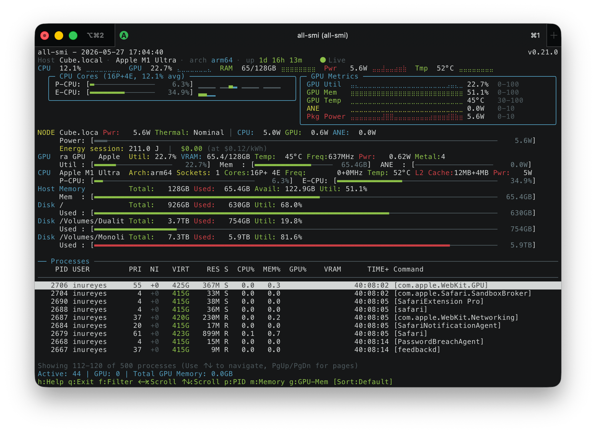
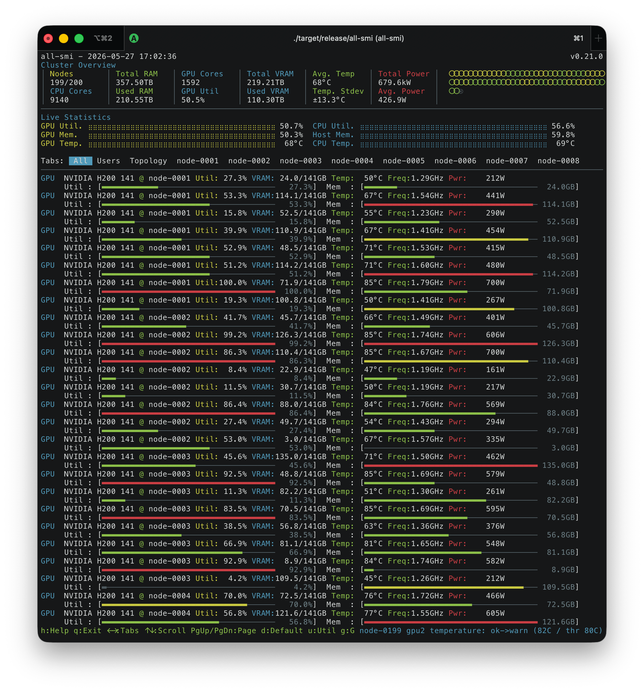
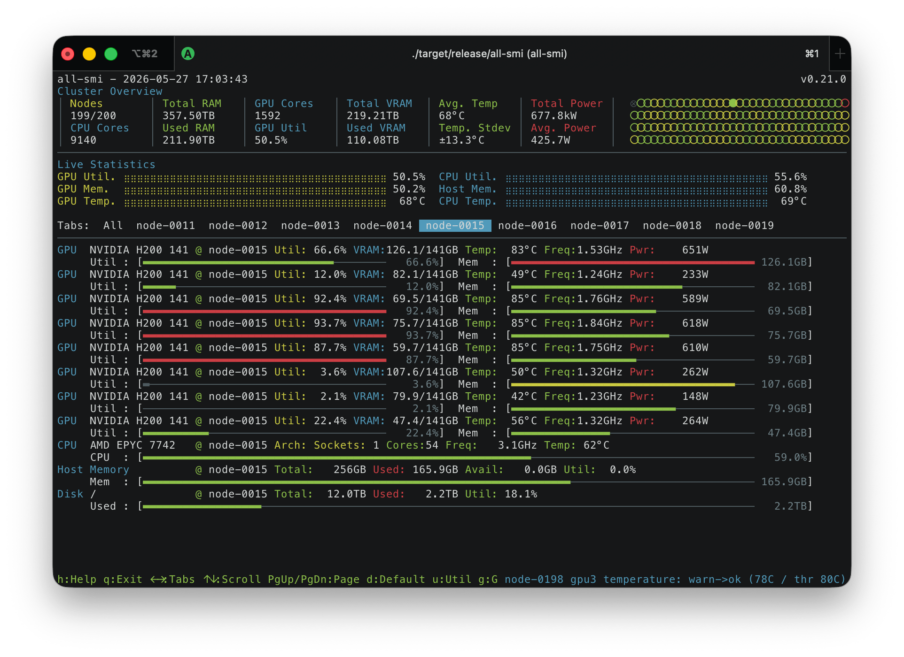

# all-smi

[](https://crates.io/crates/all-smi)
[](https://crates.io/crates/all-smi)


[](https://deps.rs/repo/github/lablup/all-smi)


`all-smi` monitors GPUs, NPUs, CPUs, and memory from one terminal — on your workstation or across a cluster. It also exports Prometheus metrics and machine-readable snapshots for monitoring systems and scripts.

- **Local and cluster views:** live utilization, memory, temperature, and power, with interactive sorting and filtering.
- **Multi-vendor monitoring:** NVIDIA, AMD, Intel, Apple Silicon, and accelerator-specific backends.
- **Remote access:** HTTP exporters or SSH, plus cluster-wide user and topology views.
- **Automation:** Prometheus, JSON/CSV snapshots, recording/replay, and a Rust library API.



<p align="center">Local-node view (on macOS)</p>



<p align="center">All-node view (remote mode)</p>



<p align="center">Node view (remote mode)</p>

## Supported hardware

| Platform | Hardware / coverage |
|---|---|
| Linux | NVIDIA, AMD Radeon/Instinct, Intel Arc/Iris Xe/Xe, NVIDIA Jetson |
| Linux accelerators | Intel Gaudi, Google Cloud TPU, Tenstorrent Wormhole/Blackhole, Rebellions ATOM family, Furiosa RNGD, AWS Trainium/Inferentia |
| macOS (Apple Silicon) | GPU, CPU, memory, ANE power, and thermal metrics; no sudo required |
| macOS (Intel) | CPU, memory, and chassis metrics; no GPU monitoring |
| Windows | NVIDIA, AMD, and Intel GPU backends, CPU and memory; sensor coverage depends on drivers and permissions |

Not every device exposes every metric. See [hardware requirements](docs/installation.md#platform-specific-requirements) for drivers, permissions, and limitations.

## Installation

### Homebrew (macOS / Linux)

```bash
brew install all-smi
```

### Ubuntu PPA

```bash
sudo add-apt-repository ppa:lablup/backend-ai
sudo apt update
sudo apt install all-smi
```

### Other installation methods

- [Pre-built binaries and Debian packages](docs/installation.md) are available from [GitHub Releases](https://github.com/lablup/all-smi/releases).
- **Cargo:** `cargo install all-smi` — see [build prerequisites](docs/installation.md#option-5-install-from-cargo). Cargo does **not** install the Linux AMD companion library; use a release archive, package, or source build for Linux AMD monitoring.
- [Build from source](DEVELOPERS.md#building-from-source).

On glibc Linux, keep `liball_smi_amd.so` with the downloaded binary for AMD monitoring. The main binary can run without it. No container image is published.

## Quick start

### Monitor this machine

```bash
all-smi
```

With default settings this opens the local TUI. `all-smi local` selects it explicitly. Press `h` for help or `q` to quit. macOS does not require sudo; other platforms may need device permissions for particular readers.

### Monitor remote nodes

Start an exporter on each node:

```bash
all-smi api --port 9090
```

Connect from your workstation:

```bash
all-smi view --hosts http://node1:9090 http://node2:9090
```

Metrics are available at `http://node1:9090/metrics`. Keep exporters on a trusted network; use your firewall or an authenticated proxy to control access. For machines without an exporter, see [SSH monitoring](docs/usage.md#agentless-ssh-mode).

### Export or capture metrics

```bash
# One-shot JSON (with default configuration)
all-smi snapshot

# Capture 30 seconds, then replay in the TUI
all-smi record --output trace.ndjson.zst --duration 30s
all-smi view --replay trace.ndjson.zst
```

See [snapshots and recording](docs/recording-and-scripting.md) for CSV, scripting, configuration caveats, and capture limitations.

### Check your environment

```bash
all-smi doctor
all-smi config path
all-smi --help
```

Configuration is optional. To keep an exporter running across reboots, follow the [service guide](docs/services.md) for your platform and installation method.

## Documentation

| I want to… | Read |
|---|---|
| Install or check hardware requirements | [Installation](docs/installation.md) |
| Use local/remote views, SSH, filters, alerts, or keyboard controls | [Monitoring guide](docs/usage.md) |
| Set persistent options or environment variables | [Configuration reference](docs/configuration.md) |
| Run an exporter at boot and find its logs | [Service guide](docs/services.md) |
| Script exports or record/replay an incident | [Snapshots and recording](docs/recording-and-scripting.md) |
| Diagnose missing metrics or create a support bundle | [Troubleshooting](docs/troubleshooting.md) |
| Integrate Prometheus, JSON, or SSE | [API reference](API.md) |
| Embed all-smi in a Rust program | [Library API](docs/LIB_mode.md) |
| Build, contribute, or run tests | [Developer guide](DEVELOPERS.md) · [Testing](TESTING.md) |
| Understand the internals | [Architecture](docs/ARCHITECTURE.md) |
| Find changes in a release | [Changelog](CHANGELOG.md) |

These documents track `main`. For a released version, browse the documentation at its Git tag and consult the [release history](CHANGELOG.md).

## Contributing

Bug reports, hardware compatibility reports, and pull requests are welcome. Start with the [contribution guidelines](DEVELOPERS.md#contributing-guidelines). For missing devices or metrics, see how to collect a [diagnostic report](docs/troubleshooting.md).

## Acknowledgments

The project's development background and tooling are described in the [development story](docs/AI_DEVELOPMENT_STORY.md).

## License

[Apache License 2.0](LICENSE).
